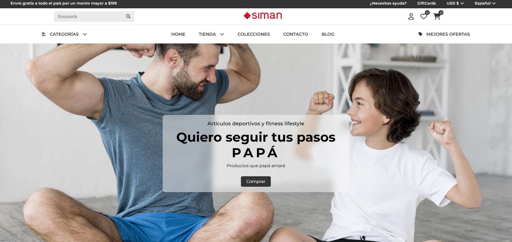
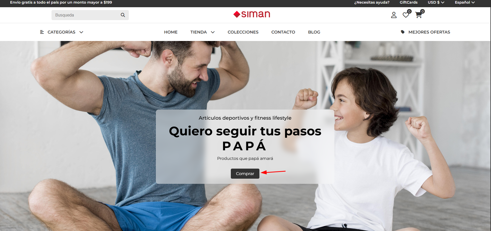
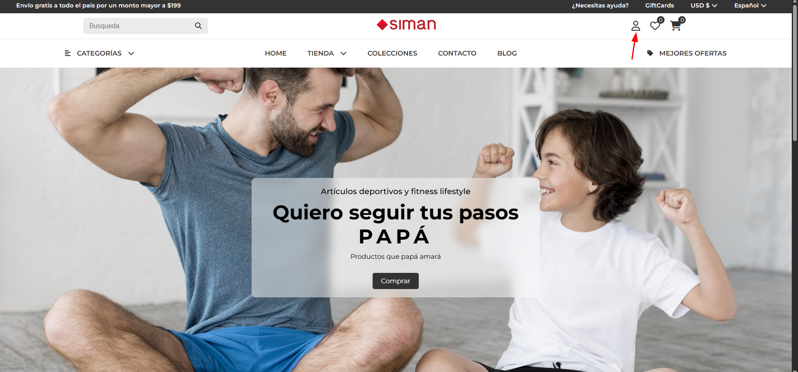

# Actividad: diseño de landing page para SIMAN

## Estudiante: Iván Alessandro Mendoza Landaverde
## Bootcamp: Full stack jr

### Descripción
Dentro del repositorio se presenta el código utilizado para el desarrollo de la landing page destinada para la empresa SIMAN.

Las vistas que se añadieron son las siguientes:
> [!IMPORTANT]
> Content table.
> 1. [Vista principal](#Vista-principal).
> 2. [Listado de productos](#Listado-de-productos)
> 3. [Login](#Login)

## Vista principal

## Listado de productos

## Login
